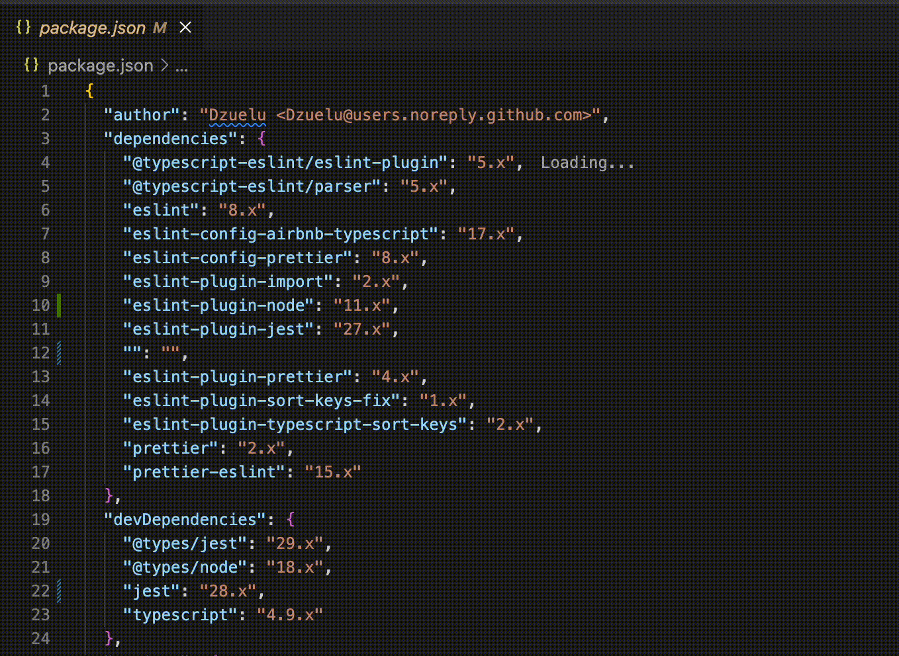

# Package Versions NPM

Local NPM or Yarn installs can be set to pull from artifactory, but default VSCode only pulls from public NPM repos.
NPM or Yarn are already used to check and update packages for your project.
Why not use it in VSCode to check the local and remote versions for you!

Works with BOTH NPM and Yarn installed packages so theres no setup besides what you've already done!


## Example commands this package uses to get remote and local versions

### Get the latest from repository
```bash
$ npm view <package> version
1.1.1
```

### Get current installed version
```bash
$ npm list <package> --depth=0
your-project@0.0.1 /Users/git/your-project
└── <package>@2.2.2
```

## Features

Pulls `package.json` versions from NPM for both local and remote repositories. That's it!



## Extension Settings

This extension contributes the following settings:

* `package-versions-npm.shell`: A shell path override if the default shell does not have access to npm. (Default uses sh)

## Known Issues

See Github Issues for known issues, or to create one.

## Release Notes

See Github Releases for release notes.

#### Used projects to help me figure out VSCode extensions
- https://github.com/pgsandstrom/package-json-upgrade

